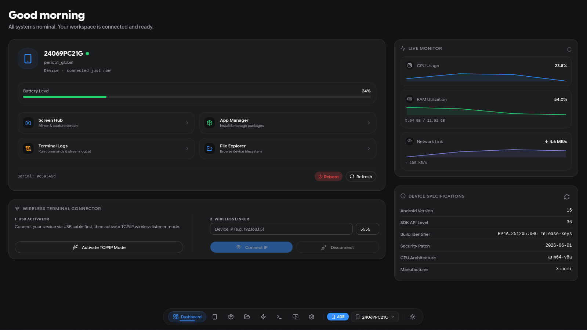
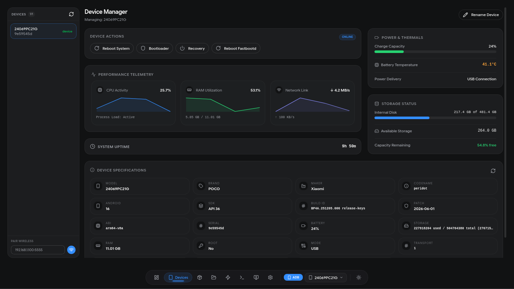
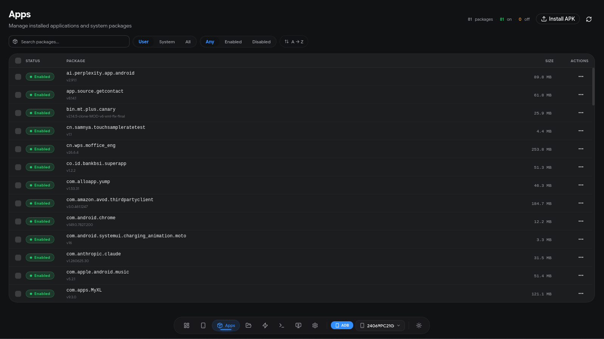
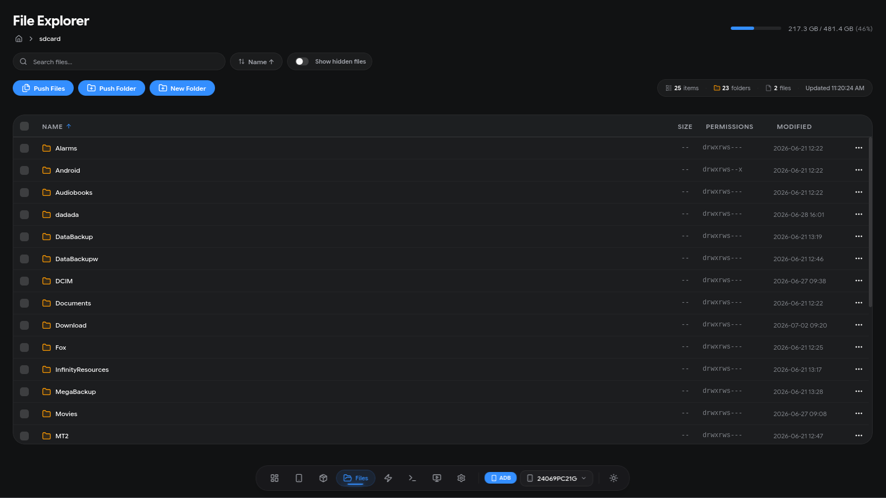
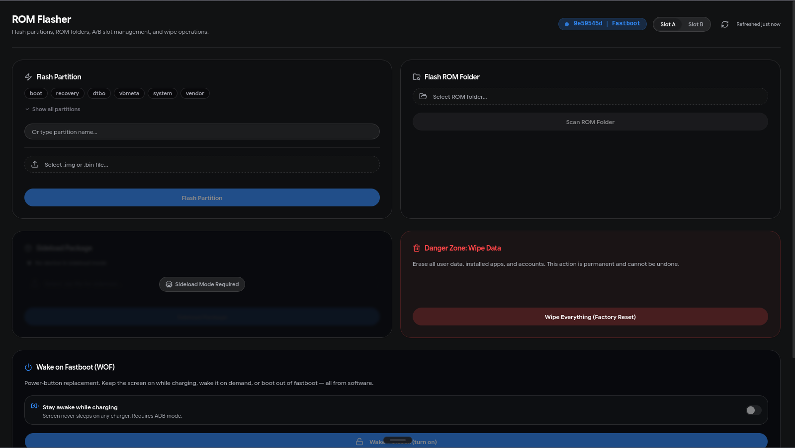
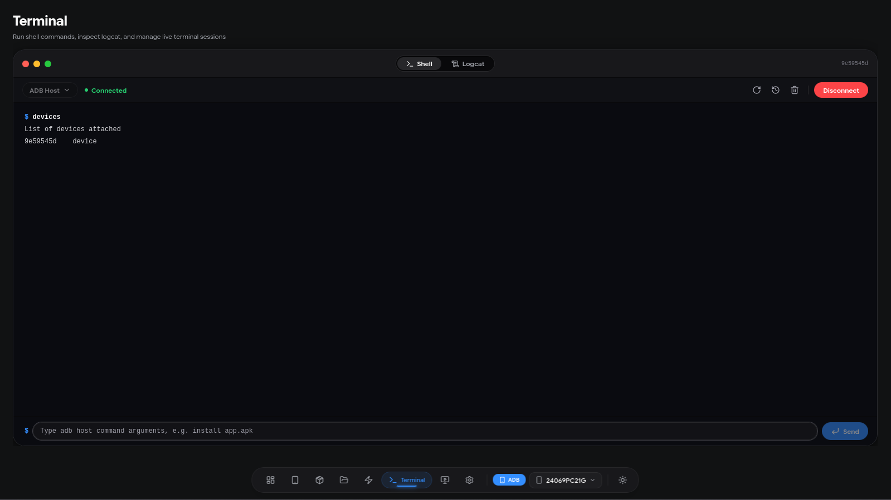
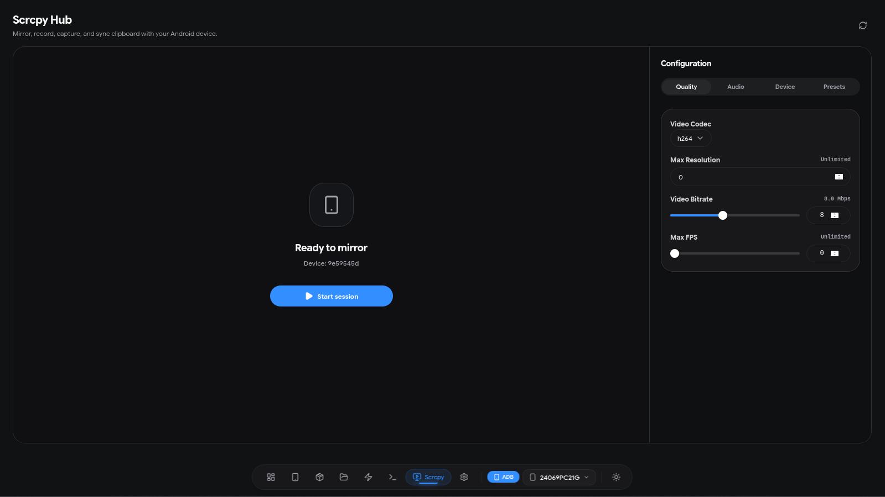
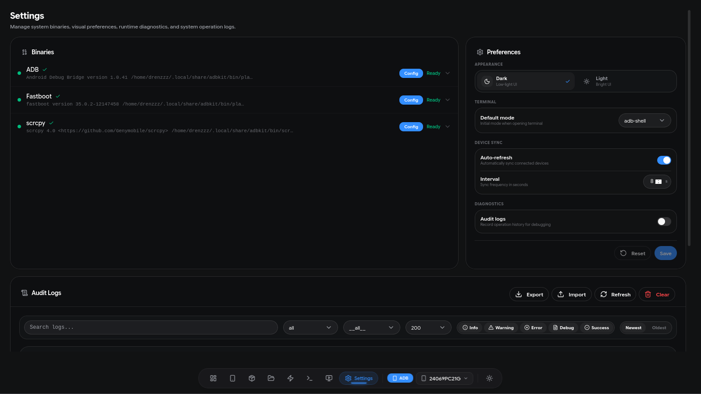

# ADBKit Screenshots

| Screenshot | Description |
|------------|-------------|
|  | Device summary, health overview, quick actions |
|  | Full device specs, reboot actions, live performance monitor |
|  | Virtualized package list, install/uninstall, search & filter |
|  | Directory navigation, push/pull, storage usage |
|  | Partition flash, ROM folder, A/B slot, sideload |
|  | ADB/Fastboot shell, command history, logcat viewer |
|  | Screen mirror, recording, clipboard sync |
|  | Theme toggle, binary manager, audit log |
